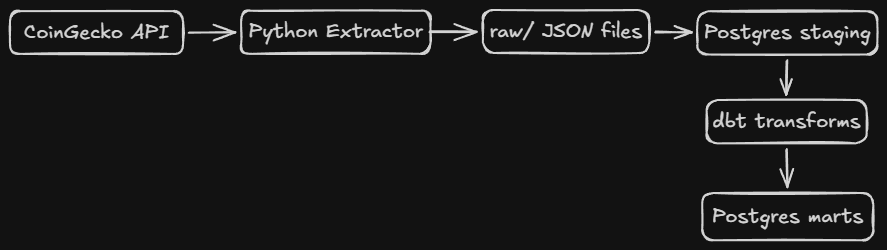
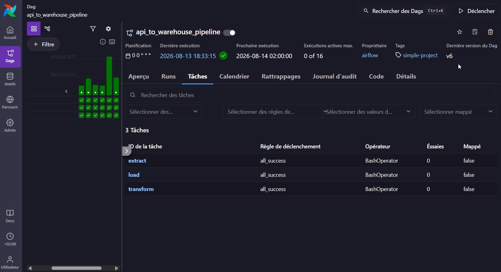

# 🚀 API-to-Warehouse Data Pipeline (ELT)

An end-to-end Data Engineering ELT pipeline that extracts daily cryptocurrency market data from the **CoinGecko REST API**, loads raw JSON into a **PostgreSQL** data warehouse, transforms it into analytics-ready models using **dbt**, and orchestrates the workflow with **Apache Airflow**—fully containerized via **Docker**.

---

## 🛠️ Tech Stack & Architecture

- **Orchestration:** Apache Airflow
- **Ingestion & Extraction:** Python (`requests`, `python-dotenv`, `sqlalchemy`)
- **Storage / Warehouse:** PostgreSQL (Raw JSONB Staging + Transformed Marts)
- **Transformation & Data Quality:** dbt (`dbt-postgres`)
- **Containerization & Tooling:** Docker & Docker Compose, Makefile

### Architecture Diagram


---

## 🔄 Data Pipeline Flow

1. **Extract (`extract.py`):** Fetches cryptocurrency market data (price, market cap, 24h volume) from CoinGecko API with retry mechanisms and saves raw JSON files to the raw data directory.
2. **Load (`load.py`):** Ingests raw JSON payloads directly into PostgreSQL inside the `staging.coins_markets_raw` table using `JSONB` format to preserve raw data history.
3. **Transform & Test (`dbt`):**
   - **Staging Layer:** Parses JSON payload keys into typed SQL columns (`coin_id`, `current_price_usd`, etc.).
   - **Marts Layer:** Aggregates price and volume metrics per coin by day (`avg_price_usd`, `market_cap_usd`, etc.).
   - **Quality Checks:** Executes dbt data tests (`dbt test`) to validate target models.

---

## 🎬 Demo



---

## 📊 Data Dictionary (`marts.fct_coin_daily_metrics`)

| Column Name | Data Type | Description |
| :--- | :--- | :--- |
| `coin_id` | `VARCHAR` | Unique identifier for the cryptocurrency (e.g., `bitcoin`) |
| `name` | `VARCHAR` | Full name of the cryptocurrency |
| `metric_date` | `DATE` | Truncated date of record extraction |
| `avg_price_usd` | `NUMERIC` | Average recorded price for the day in USD |
| `market_cap_usd` | `NUMERIC` | Maximum recorded market cap for the day in USD |
| `avg_price_change_pct_24h` | `NUMERIC` | Average 24-hour price change percentage |

---

## 🚀 Quick Start Guide

### Prerequisites
- Docker & Docker Compose
- Python 3.9+ (Optional for local script execution)

### 1. Setup Environment
Clone the repository and set up environment variables:
```bash
git clone https://github.com/Moumen-Awad/api-to-warehouse-pipeline.git
cd api-to-warehouse-pipeline
pip install -r requirements.txt
cp .env.example .env
```

### 2. Run Entire Pipeline (via Makefile)
You can build containers, extract, load, and transform the data using a single command:
```bash
make all
```

Or execute individual steps:
```bash
make up        # Spin up PostgreSQL & pgAdmin services
make extract   # Run Python extraction script
make load      # Load raw JSON into Postgres staging
make transform # Execute dbt models
make test      # Run dbt data tests
```

📁 Repository Structure
```text

api-to-warehouse-pipeline
├── airflow/
│   └── include/
│       ├── src/
│       │   ├── extract.py      # CoinGecko API Extractor
│       │   ├── load.py         # Postgres Raw JSON Loader
│       │   └── utils.py        # Logging and retry utilities
│       └── warehouse_dbt/      # dbt Transformation Project
├── docs/                       # Architecture & Demo Assets
├── .env.example                # Environment template
├── docker-compose.yml          # Local infrastructure
├── Makefile                    # CLI automation commands
├── requirements.in             # Core requirements
└── requirements.txt            # Compiled dependencies